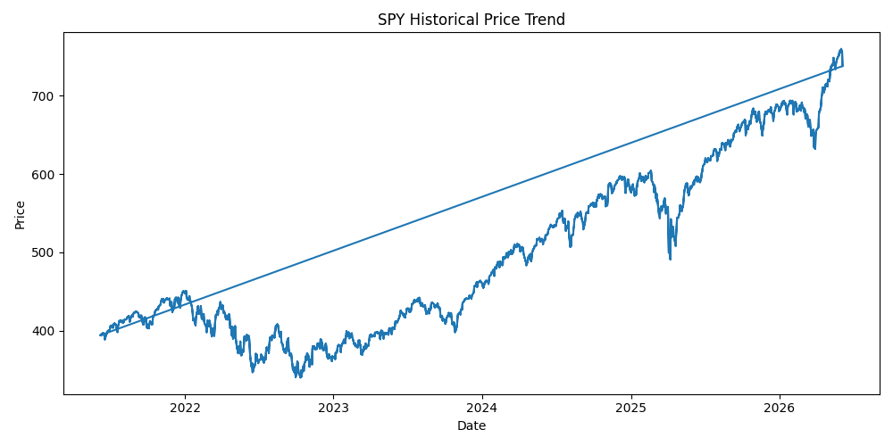
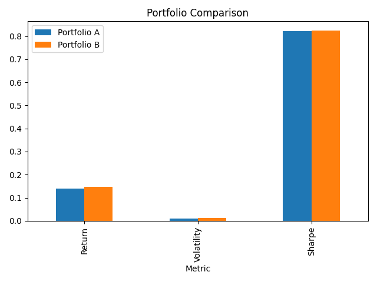
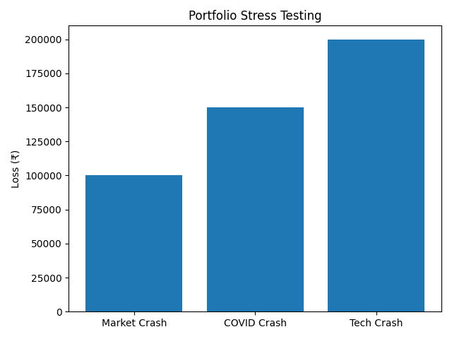
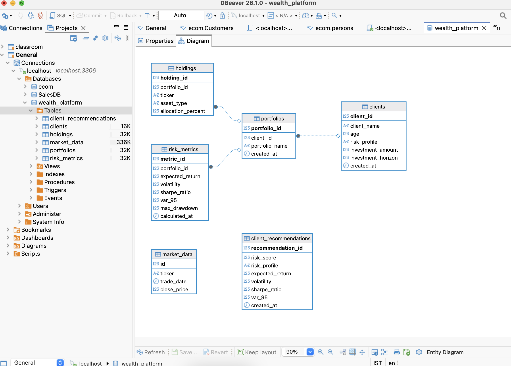

# Wealth Risk Analytics Platform

## Overview

A Python and MySQL based wealth analytics platform that performs client risk assessment, portfolio recommendation, historical backtesting, portfolio comparison, risk analytics and stress testing using real ETF market data.

The system simulates core workflows commonly found in wealth management and advisory platforms.

---

## Key Features

### Client Risk Assessment

- Risk scoring based on:
  - Age
  - Investment Horizon
  - Investor Behavior During Market Crashes

- Risk Classification:
  - Conservative
  - Moderate
  - Aggressive

---

### Portfolio Recommendation Engine

Automatically generates portfolio allocations based on investor risk profile.

#### Example Allocations

| Risk Profile | Allocation |
|-------------|------------|
| Conservative | 70% BND, 30% SPY |
| Moderate | 60% SPY, 40% BND |
| Aggressive | 80% SPY, 20% QQQ |

---

### Historical Market Data Integration

Historical ETF data was collected using Yahoo Finance.

#### ETFs Used

- SPY
- QQQ
- BND

#### Dataset Size

- 3,700+ historical market records

---

### Portfolio Risk Analytics

The platform computes:

- Annual Return
- Volatility
- Sharpe Ratio
- Historical Value at Risk (VaR)
- Maximum Drawdown

---

### Portfolio Comparison Engine

Compares alternative asset allocations using historical market performance.

#### Portfolio A

- 100% SPY

#### Portfolio B

- 80% SPY
- 20% QQQ

#### Comparison Metrics

- Expected Return
- Volatility
- Sharpe Ratio
- Value at Risk

---

### Stress Testing Engine

Simulates extreme market scenarios to estimate portfolio losses.

#### Scenarios

- Market Crash (-20%)
- COVID Style Crash (-30%)
- Technology Sector Crash (-40%)

---

## Technology Stack

### Programming

- Python

### Database

- MySQL

### Libraries

- Pandas
- NumPy
- SQLAlchemy
- PyMySQL
- yFinance

### Development Tools

- VS Code
- DBeaver

---

## Project Structure

```text
wealth-risk-analytics-platform/

├── data/
│   ├── market_data.csv
│   ├── portfolio_comparison.csv
│   └── stress_test_results.csv
│
├── database/
│   ├── schema.sql
│   └── sample_queries.sql
│
├── src/
│   ├── recommendation_engine.py
│   ├── risk_engine.py
│   ├── client_risk_engine.py
│   ├── load_market_data.py
│   └── stress_testing.py
│
└── README.md
```

---

## Database Schema

### clients

Stores investor information and risk preferences.

### portfolios

Stores portfolio information.

### holdings

Stores portfolio allocations and asset holdings.

### risk_metrics

Stores calculated portfolio risk metrics.

### market_data

Stores historical ETF market prices.

---

## Sample Risk Metrics

| Metric | Description |
|----------|-------------|
| Annual Return | Expected annual portfolio return |
| Volatility | Standard deviation of portfolio returns |
| Sharpe Ratio | Risk-adjusted return measure |
| VaR (95%) | Potential loss at 95% confidence level |
| Max Drawdown | Largest historical portfolio decline |

---
---

## Results and Visualizations

### Historical ETF Price Trend (SPY)

This figure shows the historical price movement of SPY ETF used during portfolio backtesting and risk analysis.



---

### Portfolio Comparison

Comparison of alternative portfolio allocations using historical market data.



Key Observation:
- Portfolio B achieved higher returns.
- Portfolio B also exhibited higher volatility and downside risk.

---

### Stress Testing Results

Portfolio performance under adverse market conditions.



Stress Scenarios:
- Market Crash (-20%)
- COVID Style Crash (-30%)
- Technology Sector Crash (-40%)

---

### Database Schema Snapshot

MySQL database containing client, portfolio, holdings, market data and risk analytics tables.



---

## Future Improvements

- Interactive Streamlit Dashboard
- Monte Carlo Portfolio Simulation
- Dynamic Portfolio Optimization
- Real-Time Market Data Integration
- Options Hedging Module
- Multi-Client Portfolio Management

---

## Author

Bhumika Aggarwal
